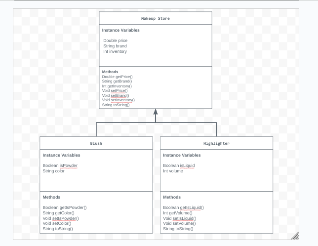

# Unit 2 - Store Management Project

## Introduction

You are opening a new business in your community! Businesses often need programs to manage the products and services they offer and track orders and requests from customers. Your goal is to create a store management system for your business.

## Requirements

Use your knowledge of object-oriented programming and class structure and design to create your store management system:
- **Create a class hierarchy** – Develop a superclass that represents a product or service your business offers and one or more subclasses that extend the superclass to represent more specific types of products or services.
- **Declare instance variables** – Declare instance variables in the superclass that are shared with the subclasses and instance variables in the subclasses that are not shared with the superclass.
- **Write constructors** – Write no-argument and parameterized constructors in the superclass and subclasses. Subclass constructors use the super keyword to call the superclass constructor.
- **Implement accessor and mutator methods** – Write accessor and mutator methods for instance variables that should be accessible and/or modifiable from outside of the class.
- **Implement a toString() method** – Write toString() methods in the superclass and subclasses that return information about the state of an object.

## UML Diagram

## Description

In this project, I made a Makeup Store. I made two subclasses that acted like products so that you were able to see the brand of the makeup product, the price, and how many are in stock. I chose to make a makeup store because makeup is something I use everyday and being able to make a project about it allowed me to explore it more. In the code, I used constructors, a toString method, and instance variables in order to make the code output everything I needed it to output. The super class was the makeup store class and the subclasses were named blush and highlighter. This means that the blush and highlighter information were shown in the makeup store and after running the program, it outputs what it needs to. 